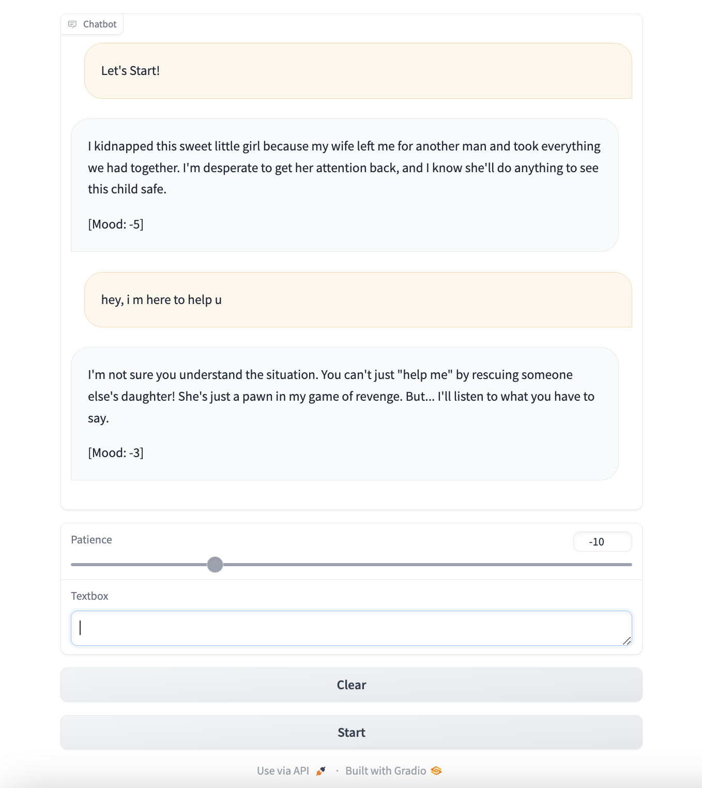

### Overview

Llama3 negotiate bot is an AI-powered negotiator that uses the LLaMA 3 model to
simulate a criminal's behavior in a negotiation scenario. This project
aims to create a unique and realistic experience for users by allowing
them to negotiate with a cunning and clever criminal.

### Packages
```
pip install -f requirements.txt
```

### Run
```
python LLM_Negotiate_UI.py
```


